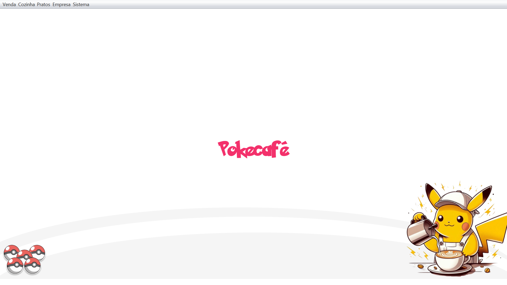
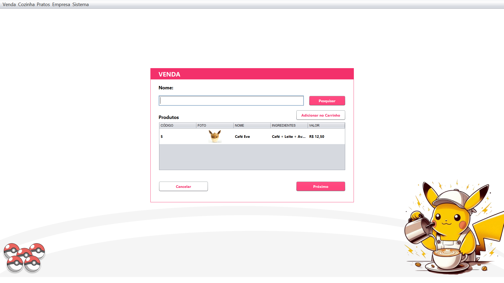

# 🧋 PokéCafé - Sistema de Vendas

Este é um sistema de gerenciamento de vendas desenvolvido para uma **cafeteria temática de Pokémon**, criado com o objetivo de estudo durante as aulas de **Programação Orientada a Objetos** no curso de **Engenharia de Software do IFAM**.

---

## 🎯 Objetivo

Este projeto foi feito com fins educacionais para aplicar conceitos de:

- Programação Orientada a Objetos (POO)
- Manipulação de banco de dados com JDBC
- Interface gráfica com Java Swing
- Manipulação de imagens
- Lógica de cadastro, listagem e controle de vendas

Como um grande fã de **Pokémon**, decidi transformar o projeto em uma cafeteria temática — o **PokéCafé** — deixando o processo de desenvolvimento ainda mais divertido e significativo.

---

## 🛠️ Tecnologias Utilizadas

- Java
- Swing (GUI)
- MySQL
- NetBeans IDE

---

## 💾 Banco de Dados

O sistema utiliza um banco de dados MySQL com tabelas para:

- `Produto`: Armazena nome, ingredientes, valor e imagem do produto
- `Usuarios`: Para login
- `Venda` e `ItemVenda`: Para registrar e controlar as vendas realizadas

As **imagens dos produtos** são carregadas e salvas no sistema, permitindo que cada item cadastrado tenha uma imagem associada.

---

## 📦 Funcionalidades

- Cadastro, edição e exclusão de produtos com imagem
- Listagem dos produtos em uma tabela com imagem visível
- Controle de carrinho de compras e finalização de vendas
- Registros de vendas com cliente, data, forma de pagamento e status
- Interface intuitiva com navegação via botões e telas modais

---

## ⚠️ Aviso

> Por conta do tempo limitado para desenvolvimento, o sistema **não possui tratamento avançado de erros**, mas está totalmente funcional e pronto para ser usado em testes ou como base para novos projetos.

---

## ✨ Screenshots *(opcional)*

### 📌 Tela de Login

### 📌 Tela Principal

### 📌 Tela de Vendas

